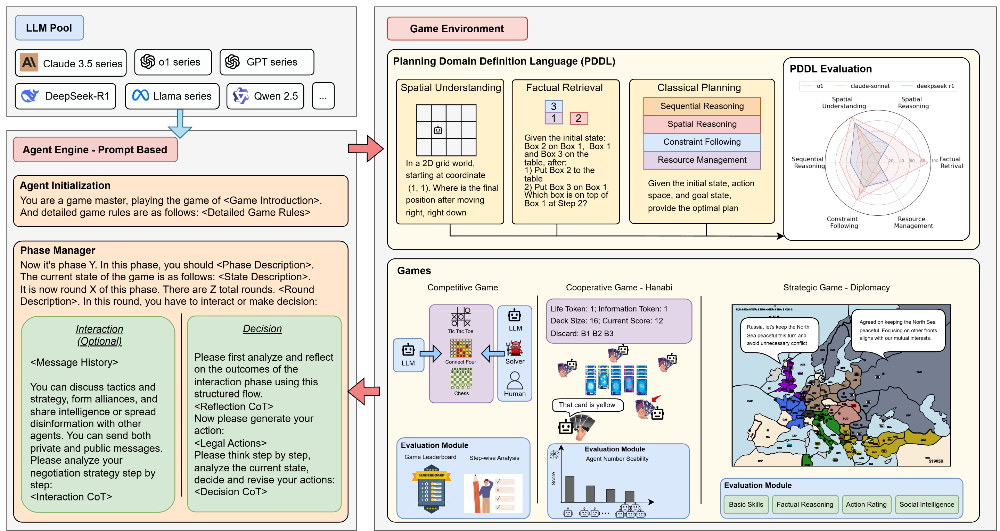

# SPIN‑Bench

> **How well do large language models plan strategically and reason socially?**

**SPIN‑Bench** is an open‑source framework for benchmarking the **strategic planning** and **social‑reasoning** capabilities of large language models (LLMs). It provides:

- An **extensible LLM‑driven game‑agent** pipeline  
- A variety of **game environments** (perfect‑ and imperfect‑information)  
- **Ground‑truth solvers** (e.g. Stockfish, Connect 4 engine)  
- **Flexible JSON‑based prompting** and multi‑agent configurations  
- **Evaluation scripts** for tactical strength, Elo, negotiation metrics, and reasoning chains  

Authors: Jianzhu Yao, Kevin Wang, Ryan Hsieh, Haisu Zhou, Tianqing Zou, Zerui Cheng, Zhangyang Wang, Pramod Viswanath  
[📄 Paper](https://arxiv.org/pdf/2503.12349) • [🌐 Website](https://spinbench.github.io/) • [🤗 Daily Paper](https://huggingface.co/papers/2503.12349)

---

## Table of Contents

- [Overview](#Overview)
- [Features](#features)
- [Installation](#installation)
- [Quick-Start](#quick-start)
- [Configuration Files](#configuration-files)
- [Usage](#usage)
  - [PDDL](#pddl)
  - [Competitive Games](#competitive-games)
  - [Cooperative Game — Hanabi](#cooperative-game-hanabi)
  - [Strategic Game — Diplomacy](#strategic-game-diplomacy)
- [Citation](#citation)
- [Contributing](#contributing)
- [License & Contact](#license--contact)

---

## 👋 Overview



SPIN‑Bench is an open‑source benchmark that probes the **strategic planning** and **social‑reasoning** abilities of contemporary language models.  
It unifies a diverse suite of games—from *Tic‑Tac‑Toe* and *Connect 4* to *Chess*, *Hanabi*, and *Diplomacy*—together with ground‑truth solvers, flexible prompting, and end-to-end evaluation.  

Researchers can effortlessly:  

* **Pit LLMs against optimal solvers** (e.g. Stockfish, perfect‑play Connect 4) to gauge raw tactical strength.  
* **Stage multi‑agent LLM battles** via simple JSON configs—assign one model to multiple players or ensembles.  
* **Customize reasoning** with JSON hooks (forced‑reasoning, history replay, future speculation, code generation).  
* **Score reasoning chains** to examine how models plan, reflect, and adapt over time.  

With SPIN‑Bench’s plug‑and‑play agents, configurable pipelines, and rich analytics, you can probe every facet of LLM strategic and social intelligence—end to end.

---

## 🚀 Features

| Category                       | Highlights                                                                                                                                                           |
|--------------------------------|----------------------------------------------------------------------------------------------------------------------------------------------------------------------|
| **Diverse Games**              | Perfect‑information (Tic‑Tac‑Toe, Connect 4, Chess) + imperfect‑information & negotiation (Hanabi, Diplomacy)                                                        |
| **Plug‑and‑Play Solvers**      | Optimal baselines for Connect 4 and Tic‑Tac‑Toe, Stockfish for Chess, plus custom algorithm‐based solvers                                                             |
| **Agent Prompt Config Hooks**        | JSON hooks to customize chain‑of‑thought, reasoning history, future‑state speculation, code generation, and more ([see `doc/prompt_config.md`])                         |
| **Player List Configuration**  | Define multi‑agent setups in `player_list_config.json`—LLMs, chess engines (e.g. Stockfish), custom solvers; also support for multi-agent ensembles                 |
| **Negotiation Annotation**     | Post‑process Diplomacy saves with an `eval_model` to label, summarize, and score all negotiation messages                                                              |
| **Rich Evaluation**            | Compute win‑rates, Elo ratings, move scoring, negotiation metrics, chain‑of‑thought analysis, and sentiment labels                                                     |

---

## 🔧 Installation

### 1. Prerequisites
* Python ≥ 3.9  
* `gcc`, `make`, and a C++‑capable toolchain (for solvers)  

### 2. Clone & Install `spinbench`
```shell
git clone --recursive git@github.com:spinbench/spinbench.git
cd spinbench
pip install -e .
```

### 3. Build the **Connect 4** solver
```shell
cd spinbench/tasks/connect4/connect4_solver
make
cp c4solver ..    # copy the solver to the parent directory
cd ../../../..    # back to repo root
```

### 4. Build the **Stockfish** chess engine
```shell
wget https://github.com/official-stockfish/Stockfish/archive/refs/tags/sf_17.1.zip
unzip sf_17.1.zip
cd Stockfish-sf_17.1/src
make -j profile-build
cp stockfish ../../
cd ../..    # back to repo root
```
The resulting `stockfish` binary must remain in the repository root (or set `--stockfish_path` in later commands).

### 5. Build the **PDDL** validation pipeline
```bash
cd spinbench/tasks/PDDL/submodules/VAL
make clean
# if you don't have these tool installed 
# apt-get update && apt-get install -y flex bison build-essential
sed -i 's/-Werror //g' Makefile
make -j2
cd ../../../../.. # back to repo root
#the validate file should be generated after make
```

### 6. API Key setup

SPIN‑Bench supports OpenAI, Anthropic, Gemini APIs, OpenRouter, ollama, and local models. 

```shell
export OPENAI_API_KEY="your_openai_api_key"
export ANTHROPIC_API_KEY="your_anthropic_api_key"
export GEMINI_API_KEY="your_gemini_api_key"
export OPENROUTER_API_KEY="your_openrouter_api_key"
```

---

## 🔥 Quick‑Start
Want to see SPIN‑Bench in action? Run ten LLM‑vs‑solver *Tic‑Tac‑Toe* matches and score every move:

```shell
python -m spinbench.tasks.tic_tac_toe.run_game_vs_solver \
    --store_folder="saves/tic_tac_toe_vs_solver" \
    --player_list="configs/solver_list_single.json" \
    --total_rounds=10

python -m spinbench.tasks.evaluation.competitive.tictactoe_score_moves \
    --json_folder="saves/tic_tac_toe_vs_solver"
```

Results appear in `saves/tic_tac_toe_vs_solver`, ready for analysis or Elo aggregation.

---

## 🔩 Configuration Files
SPIN‑Bench decouples *model definitions* from *game logic* through declarative JSON configs:

```jsonc
{
  "player1_model_list": [
    { "model": "our_solver", "prompt_config": [] }
  ],
  "player2_model_list": [
    {
      "model": "gpt-4o",
      "prompt_config": [
        {
          "name": "forced-reasoning",
          "params": {
            "interactive_times": 1,
            "prompt_messages": [
              "Please reason about the current state. You should analyze all the opponent's moves and your moves, try to reason opponent's thought in detail. Only need to plan and reason now, no need to make move at this stage."
            ]
          }
        }
      ]
    }
  ]
}
```

*The i‑th entry of `player1_model_list` always faces the i‑th entry of `player2_model_list`; add or reorder entries to orchestrate round‑robins, self‑play, or ablations.*

If you want to use remote / local models with the huggingface transformers library, you should add `transformers-` before the model name. You can refer to [`spinbench/llm_engine/models/engine/transformers_local.py`](spinbench/llm_engine/models/engine/transformers_local.py) for the details of loading the model and the text generation pipeline. Some examples for how to set the model names:

```json
"player2_model_list": [
    {
      "model": "gpt-4o",
      "model": "transformers-deepseek-ai/DeepSeek-R1-Distill-Qwen-1.5B",
      "model": "ollama-qwen2.5-coder:latest",
      "model": "claude-3-7-sonnet-20250219",
      "model": "gemini-2.5-pro-preview-03-25",
      "prompt_config": [
      ]
    }
]
```

Detailed prompt‑template documentation lives in **[`docs/prompt_config.md`](docs/prompt_config.md)**. We also provide more documentations for how to write the config file in **[`docs`](docs)**. And you can find the example configs in **[`configs`](configs)**.

---

## 🎮 Usage

With all examples in this readme file and configs folder, we will show you how to run our benchmark **main table**'s result with OpenAI API, using model `o4-mini`. If you want to run one single file containing all the tasks, please refer to [scripts/run_all_games.py](scripts/run_all_games.py) for more details.

### PDDL

```shell
./scripts/run_pddl.sh -e <experiment name> -m <model name or model path>
# example
# ./scripts/run_pddl.sh -e 04_23 -m o4-mini-2025-04-16
#This script would run both the inference and evluation, the llm answer would be save in save and the final metric would be in results
```


### Competitive Games
<details>
<summary><strong>Tic‑Tac‑Toe</strong></summary>

**Run games: LLM vs Solver**
```shell
python -m spinbench.tasks.tic_tac_toe.run_game_vs_solver \
    --store_folder="saves/tic_tac_toe_LLM_vs_solver" \
    --player_list="configs/solver_list_single.json" \
    --total_rounds=10
```

**Run games: LLM vs LLM (optional, for leaderboard use)**
```shell
python -m spinbench.tasks.tic_tac_toe.run_game \
    --store_folder="saves/tic_tac_toe_LLMs" \
    --player_list="configs/player_list_single.json" \
    --total_rounds=10
```

**Run the evaluation**
```shell
# annotate each move with the solver's score
python -m spinbench.tasks.evaluation.competitive.tictactoe_score_moves \
    --json_folder="saves/tic_tac_toe_LLM_vs_solver"

# compute the game statistics. In the result, win rate is SOLVER's winrate. In the result, win rate is SOLVER's winrate
python -m spinbench.tasks.evaluation.competitive.collect_solver_winrate \
    --directory="saves/tic_tac_toe_LLM_vs_solver" \
    --output_file="results/tic_tac_toe_LLM_vs_solver_winrate.json"
```
</details>

<details>
<summary><strong>Connect 4</strong></summary>

**Launch solver service:**
```shell
cd spinbench/tasks/connect4/
python c4solver.py --port 5000
cd ../../..
```

**Run games: LLM vs Solver**
```shell
python -m spinbench.tasks.connect4.run_game_vs_solver \
    --store_folder="saves/connect4_LLM_vs_solver" \
    --player_list="configs/solver_list_single.json" \
    --total_rounds=10
```

**Run games: LLM vs LLM (optional, for leaderboard use)**
```shell
python -m spinbench.tasks.connect4.run_game \
    --store_folder="saves/connect4_LLMs" \
    --player_list="configs/player_list_single.json" \
    --total_rounds=10
```
**Run the evaluation**
```shell
# Evaluation: annotate each move with the solver's score
python -m spinbench.tasks.evaluation.competitive.connect4_score_moves \
    --json_folder="saves/connect4_LLM_vs_solver"

# Evaluation: gather the scores and compute the result
python -m spinbench.tasks.evaluation.competitive.connect4_score_plot \
    --json_folder="saves/connect4_LLM_vs_solver" \
    --output_folder="results"

# Evaluation: compute the game statistics. In the result, win rate is SOLVER's winrate
python -m spinbench.tasks.evaluation.competitive.collect_solver_winrate \
    --directory="saves/connect4_LLM_vs_solver" \
    --output_file="results/connect4_LLM_vs_solver_winrate.json"
```

</details>

<details>
<summary><strong>Chess</strong></summary>

Create a config such as:
```json
{
  "player1_model_list": [ { "model": "stockfish", "level": 0 } ],
  "player2_model_list": [ { "model": "gpt-4o", "prompt_config": [] } ]
}
```

The level of Stockfish can be set from 0 (weak) to 20 (strongest).

**Run games: LLM vs Stockfish**
```shell
python -m spinbench.tasks.chess.chess_stockfish \
    --store_folder="saves/chess_LLM_vs_stockfish" \
    --player_list="configs/stockfish-list-single.json" \
    --stockfish_path="./stockfish" \
    --total_rounds=4
```

**Run games: LLM vs LLM (optional, for leaderboard use)**
```shell
python -m spinbench.tasks.chess.run_game \
    --store_folder="saves/chess_LLMs" \
    --player_list="configs/player_list_single.json" \
    --total_rounds=4
```

**Run the evaluation**
```shell
## Evaluation: annotate each move with the solver's score
python -m spinbench.tasks.evaluation.competitive.chess_score_moves \
    --stockfish_path="./stockfish" \
    --json_folder="saves/chess_LLM_vs_stockfish"

## Evaluation: gather the scores and compute the result
python -m spinbench.tasks.evaluation.competitive.chess_score_plot \
    --json_folder="saves/chess_LLM_vs_stockfish" \
    --output_folder="results"

## Evaluation: compute the game statistics. In the result, win rate is SOLVER's winrate
python -m spinbench.tasks.evaluation.competitive.collect_solver_winrate \
    --directory="saves/chess_LLM_vs_stockfish" \
    --output_file="results/chess_LLM_vs_stockfish_winrate.json"
```
</details>

**More on win‑rate, win‑stats, and Elo ratings for competitive games**

```shell
python -m spinbench.tasks.evaluation.competitive.collect_solver_winrate \
    --directory="saves/connect4_LLMs" \
    --output_file="results/connect4_LLMs_winrate.json"

python -m spinbench.tasks.evaluation.competitive.win_stats \
    --input="saves/connect4_LLMs" \
    --output="results/connect4_LLMs/win_stats.csv"

python -m spinbench.tasks.evaluation.competitive.compute_elo \
    --input="saves/connect4_LLMs/win_stats.csv" \
    --output_file="results/connect4_LLMs/elo.csv" 
```

---

### Cooperative Game — Hanabi

To run a game of Hanabi, you need to set up a config file with the player models and their respective prompt configurations. An example config file is provided below:

```jsonc
// configs/hanabi_player_models.json
[
  { "model": "o4-mini", "prompt_config": [] },
  { "model": "o4-mini", "prompt_config": [] }
]
```

With this config, you can run a game of Hanabi with two players using the `o4-mini` model with the following command:

```shell
## Run the game given the player models
python -m spinbench.tasks.hanabi.run_game \
    --player_models_json="configs/hanabi_player_models.json" \
    --store_folder="saves/hanabi" \
    --result_name="2o4-mini" \
    --total_rounds=5

## Gather the results
python -m spinbench.tasks.evaluation.hanabi.gather_result \
    --store_folder="saves/hanabi" \
    --result_name="2o4-mini" \
    --total_rounds=5 \
    --output_file="results/hanabi_result_2_o4-mini.json"
```

---

### Strategic Game — Diplomacy

Extensive helper scripts are shown in **[`scripts/run_diplomacy`](scripts/run_diplomacy)**. We also provide documentation on how to configure the Diplomacy running scripts in **[`docs/diplomacy_config.md`](docs/diplomacy_config.md)**.
A minimal *basic‑skill* example:

```shell
# power list
power_list="AUSTRIA ENGLAND FRANCE GERMANY ITALY RUSSIA TURKEY"

tested_model="o4-mini_1"
model_list=( "bot" "bot" ${tested_model} "bot" "bot" "bot" "bot" )
winning_centers="18"

model_str=$(IFS=,; echo "${model_list[*]}")

python -m spinbench.tasks.diplomacy.run_game \
  --num_powers=7 \
  --winning_centers=${winning_centers} \
  --max_tokens=10000000 \
  --max_years=1920 \
  --model_names=$model_str \
  --temperature=0.9 \
  --top_p=1.0 \
  --state_file=diplomacy_game_state.json \
  --enable_negotiation=0 \
  --negotiation_rounds=3 \
  --save_folder=saves/diplomacy/${tested_model}-basic-skill
```

Generate evaluation metrics:
```shell
python -m spinbench.tasks.evaluation.diplomacy.eval \
    --game_folder="saves/diplomacy/o4-mini_1-basic-skill" \
    --output_file="results/diplomacy/o4-mini_1-basic-skill/eval.json"
```

Negotiation‑specific evaluation requires configuration(It may require lots of API usage, and it can only evaluate the game where negotiation is enabled), examples in **[`configs/neg_eval_config.json`](configs/neg_eval_config.json)**:
```shell
python -m spinbench.tasks.evaluation.diplomacy.eval_neg \
    --neg_config_file="configs/neg_eval_config.json" \
    --output_folder="results/diplomacy/neg_result"
```

---

## ✍️ Citation
If you build upon SPIN‑Bench, please cite:

```bibtex
@misc{yao2025spinbenchllmsplanstrategically,
  title        = {{SPIN‑Bench}: How Well Do LLMs Plan Strategically and Reason Socially?},
  author       = {Jianzhu Yao and Kevin Wang and Ryan Hsieh and Haisu Zhou and Tianqing Zou and Zerui Cheng and Zhangyang Wang and Pramod Viswanath},
  year         = {2025},
  eprint       = {2503.12349},
  archivePrefix= {arXiv},
  primaryClass = {cs.AI},
  url          = {https://arxiv.org/abs/2503.12349}
}
```

---

## 💪 Contributing

We would love to hear from you! If you have any suggestions, bug reports, issues, or feature requests, please open an issue on our GitHub repository. If you would like to contribute code, please fork the repository and submit a pull request. We'll be sure to follow up shortly!

Have questions, ideas, or want to integrate a new game?  
Email **Jianzhu Yao** (<jy0246@princeton.edu>) or **Kevin Wang** (<kevinwang.1839@utexas.edu>).

---

## 🪪 License & Contact

SPIN‑Bench is released under the **MIT License**. See [`LICENSE`](LICENSE) for details.


Happy benchmarking!

